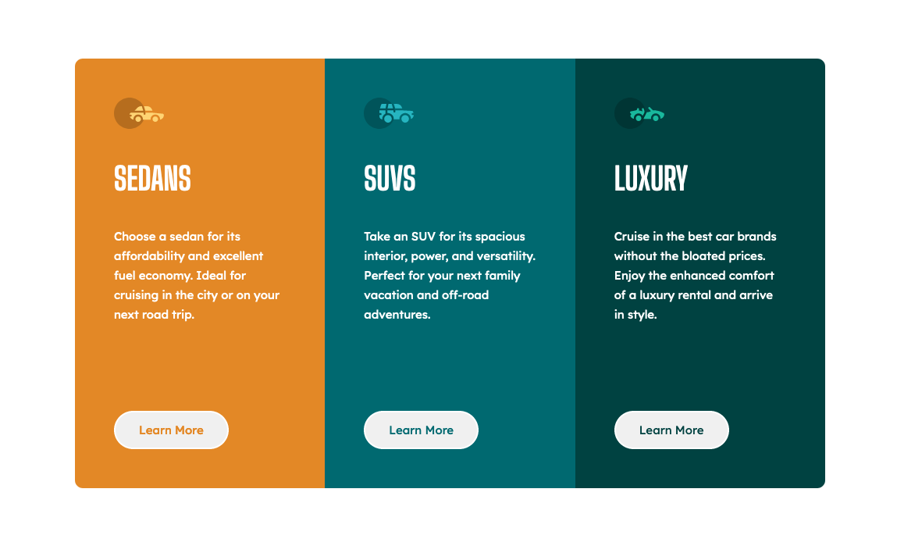

# Frontend Mentor - 3-column preview card component solution

This is a solution to the [3-column preview card component challenge on Frontend Mentor](https://www.frontendmentor.io/challenges/3column-preview-card-component-pH92eAR2-). Frontend Mentor challenges help you improve your coding skills by building realistic projects. 

## Table of contents

- [Overview](#overview)
  - [The challenge](#the-challenge)
  - [Screenshot](#screenshot)
  - [Links](#links)
- [My process](#my-process)
  - [Built with](#built-with)
  - [What I learned](#what-i-learned)
  - [Continued development](#continued-development)
- [Author](#author)

## Overview

A simple 3 column preview card.

### The challenge

Users should be able to:

- View the optimal layout depending on their device's screen size
- See hover states for interactive elements

### Screenshot

### Links

- Live Site URL: [live site URL](https://your-live-site-url.com)

## My process
First started with setting up all of my files. I created my styles folder with my global and style sass files. Put all of the global parameters I put into every project. Then moved to the index html and created all the necessary sections with their identifiers if needed. After index file was done, I moved to styling all of the css through trial and error. I did my best to organize the css files so there is a type of hierachy order as well as creating custom properties that could potentially be reused.

### Built with

- Semantic HTML5 markup
- CSS custom properties
- SASS
- Flexbox
- Desktop-first workflow

### What I learned

Fortunately for this one, there wasn't any point where I got stuck and didn't know what to do. I simply got more practice with doing simple css.

### Continued development

This is my second challenge that I've attempted and I already feel much more confident tackling these beginner projects. Once I do a few more I think it'll be good to move onto more difficult ones using javascript.

## Author

- Website - [Alfonso Pruneda](https://alfonsopruneda.netlify.app)
- Frontend Mentor - [@915fonzie](https://www.frontendmentor.io/profile/915fonzie)
- Twitter - [@915fonzie](https://www.twitter.com/915fonzie)
